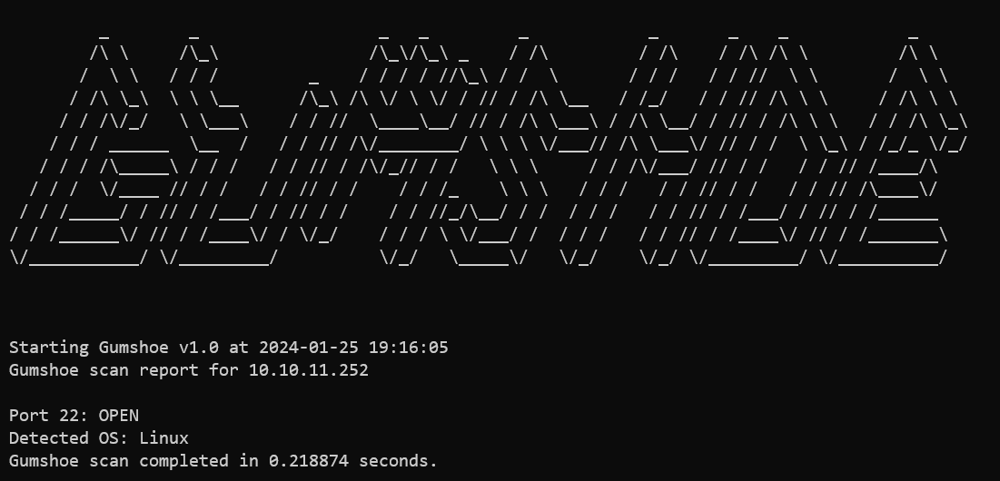

# Gumshoe



Gumshoe is a port scanner developed as a project for CST338.

Functionalities include:
- TCP SYN scan
- UDP scan
- TCP FIN, NULL, Xmas scans
- Ping sweep
- Passive OS fingerprinting
- Writing to file

## Installation

It is recommended that you set up a virtual environment beforehand.

Then, install the required dependencies.
```
pip install -r requirements.txt
```

Run the following to get the help menu:
```
python3 gumshoe.py -h
```

> Note: Running TCP scans require `sudo` privileges.